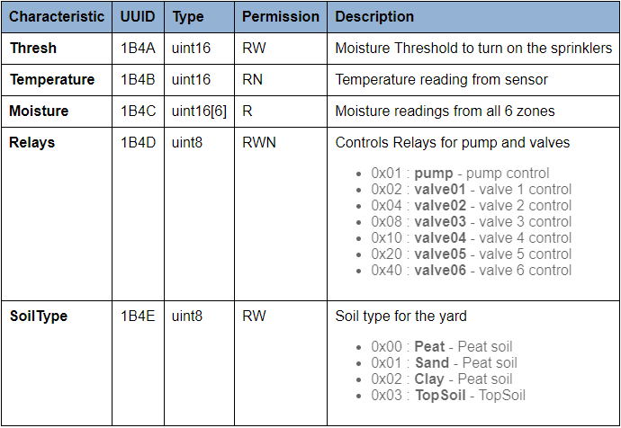
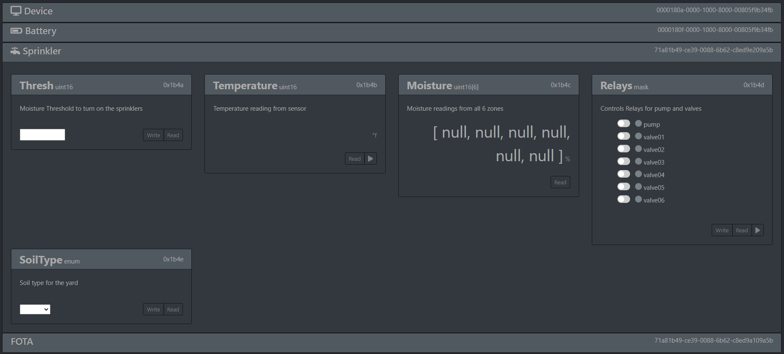

ESP32 Gatt Standalone
=====================

This is an example project demonstrating the use the the ``mrt-ble`` tool to create a gatt server on the ESP32 platform. ``Standalone`` refers to the fact that the project does not actually use the ``MrT`` framework. The ``mrt-ble`` utility just pulls the necessary adapter files into the project. 

The project is broken into n steps, and in the repository there is a commit for each step of the process to reference. 

.. note: while this can be done in any IDE you prefer, some of notes in the walkthrough assume the project is opened in VS Code.

Step 0: Starting Point
----------------------

The starting point of the project is the ``gatt_server_service_table`` example from the `esp-idf v4.3.1 <https://github.com/espressif/esp-idf.git>`_. The only things changed from the original example are:

- The original 'Tutorial' folder is removed for clarity
- An ESP32 Devcontainer has been added
- Certificate Bundle disabled.
    - There is a problem with the Certificate file that ships with the IDF. Since it is not related to Bluetooth, we can just disable it for this demonstration
    - Coponent Config->mbedTLS->Certificate Bundle->Enable trusted root Certificate bundle

To get started, open the project in VS Code, and click the `Remote` button |pic1| in the bottom left corner. Then select 'Reopen in Container'

.. note:: if not using the devcontainer, you will need to install mrtutils via `pip install mrtutils` 

Step 1: Removing old ble code 
-----------------------------

Because we are providing our own gatt services and handlers, we can get rid of the ones set up in the example. All we really need to keep is the NVS configuration. In a real project we would also rename the ``gatts_table_create_demo.c`` to ``main.c``, but to keep the differences between steps as clear as possible, it is left with the original name. 

.. note:: The easiest way to see what was removed is to open the ``gatts_table_create_demo.c`` and view the file Timeline to see the diff between commits 

Step 2: Specify the Gatt Profile
--------------------------------

``mrt-ble`` uses yaml files to describe gatt profiles and generate code. The easiest way to get started is to generate the sample template 

.. code:: bash 

    mrt-ble -t example_profile 

This will generate `example_profile.yml` which contains an example profile for a battery powered sprinkler control system. The file has comments explaining the various features but more detailed information can be found in the `MrT Docs <https://mrt.readthedocs.io/en/latest/pages/mrtutils/mrt-ble.html#step-1-define-the-profile>`_

Step 3: Generate the Code and ICD 
---------------------------------

In a real project, you would want to modify ``example_profile.yml`` to meet the needs of your project. But to keep this example simple, we will just go ahead and build the sample protocol. 

Code 
~~~~

First we will generate the code

.. code:: bash 

    mrt-ble -i example_profile.yml -o main/gatt -p esp32 

`This will generate the c code for our profile`

.. code:: text

     main/gatt
           ├── interface
           │       ├── mrt_gatt_interface.h
           │       ├── mrt_gatt_interface.c
           │       ├── esp32_gatt_adapter.h
           │       └── esp32_gatt_adapter.c   
           ├── svc
           |   ├── bat_svc.c
           |   ├── bat_svc.h
           |   ├── dvc_svc.c
           |   ├── dvc_svc.h
           |   ├── ota_svc.c
           |   ├── ota_svc.h
           |   ├── spr_svc.c
           |   └── spr_svc.h
           ├── app_bat_svc.c
           ├── app_dvc_svc.c
           ├── app_ota_svc.c
           ├── app_spr_svc.c
           ├── CMakeLists.txt
           ├── component.mk
           ├── sample_gatt_server.c
           └── sample_gatt_server.h

- **./interface/mrt_gatt_interface**    
    This is the gatt interface from the MrT GattInterface submodule. It provides a common structure for defining gatt profiles, services, and characteristics. This code is common for any device using the MrT Gatt interface. Each platform requires an 'Adapter' module to convert native structs to the MrT format

- **./interface/esp32_gatt_adapter**    
    This is the adapter module for the ESP32 platform. It is pulled from the MrT ESP32 Platform Module. It adapts the MrT interface and extends the functionality to be compatible with the api provided in the esp-idf 

- **./svc/\***
    The files in the ``svc`` folder are the service definitions. They define all of the structures, data types, initialization code, and event handlers for the service. The handlers are weakly defined and overriden in the application layer, so these files should never be edited. 

- **./app_x_svc.c**
    For every service in the profile, there will be an application level service file named app_<service prefix>_svx.c. These files contain the handlers for the services and characteristics which can be edited to do whatever is needed with the data. 

- **./sample_gatt_server**
    This is our main piece of application code. It creates the profile, and contains event handlers which convert events from esp32 format to the MrT format and dispatches them to our handler functions.

- **misc**:
    ``CMakeLists.txt`` and ``component.mk`` are project level files used in esp32 projects for the build system. These should not need to be modified.

.. important:: The files in the ``svc`` folder should not be edited. everything should be handled in the application layer using the app_x_svc.c files 

ICD 
~~~

`When generating the code we can also generate an ICD:`

.. code:: bash 

    mrt-ble -i example_profile.yml -o main/gatt -d icd -p esp32

This will create 2 new files: 

- **./icd/sample_gatt_icd.html:**
    This is a formatted ICD of the profile in html format. It is just created for documentation 

- **./icd/sample_live_icd.html:**
    This is the "live" ICD. It is actually a single page web app which uses the Web Bluetooth Api. If opened on a computer with BLE support, it can connect to the device and provide graphical interface for interacting with it. 

Step 4: Code Integration
------------------------

In this step we will start the gatt server, and add functionality to the event handlers. First we need to modify the projects Makefile to include the newly added code. 

.. code:: make 

    #
    # This is a project Makefile. It is assumed the directory this Makefile resides in is a
    # project subdirectory.
    #

    PROJECT_NAME := esp32_mrt_test

    EXTRA_COMPONENT_DIRS := main/gatt
    COMPONENT_ADD_INCLUDEDIRS := components/include

    include $(IDF_PATH)/make/project.mk

Start Server 
~~~~~~~~~~~~

To start the gatt server, we need to edit the main source file, which in this case is called ``gatts_table_create_demo.c``:

`Include sample_gatt_server`: 

.. code:: c 

    #include "gatt/sample_gatt_server.h" 

`Start Server` 

.. code:: c 

    void app_main(void)
    {
        esp_err_t ret;

        // Initialize NVS.
        ret = nvs_flash_init();
        if (ret == ESP_ERR_NVS_NO_FREE_PAGES || ret == ESP_ERR_NVS_NEW_VERSION_FOUND) {
            ESP_ERROR_CHECK(nvs_flash_erase());
            ret = nvs_flash_init();
        }
        ESP_ERROR_CHECK( ret );

        easyrider_gatts_start();    //Start the server 

        return;
    }

Modify Handlers 
~~~~~~~~~~~~~~~

Now that the server is started we can add logic to our services.  

in our application layer service file for the ``Sprinkler Service`` (`main/gatt/app_spr_svc.c:`) we can find the event handler for the ``Relays`` characteristic at line 69. By default only 'Write' events get passed to the handler, because in most cases the `Read` events are handled by the system. (`this can be changed in the mrt_gatt_handle_evt function of esp32_gatt_adapter.c`). 

By default the handlers do not do anything, but they contain commented out code stubs based on the type of characteristic. Because the Relay characteristic is a bitmask, it generates a series of `if` statements to check each bit value. 

For this example, we will use an LED to indicate when the pump relay is on

`Include gpio driver, and define gpio for led. On most dev boards this is IO2`

.. code:: c 

    #include "driver/gpio.h"

    #define GPIO_LED 2

`Initialize the gpio in our post_init_handler` 

.. code:: c 

    /**
    * @brief Called after GATT Server is intialized
    */
    void spr_svc_post_init_handler(void)
    {
        //Configure LED pin 
        gpio_reset_pin(GPIO_LED);
        gpio_set_direction(GPIO_LED, GPIO_MODE_OUTPUT);
}
    }

`Set the LED based on the value of the Pump bit in our bitmask` 

.. code:: c 

    /**
    * @brief Handles GATT event on Relays Characteristic
    * @param event - ptr to mrt_gatt_evt_t event with data and event type
    */
    mrt_status_t spr_relays_handler(mrt_gatt_evt_t* event)
    {

        spr_relays_t val = *((spr_relays_t*) event->data.value); /* Cast to correct data type*/

        //Set LED output based on bit for pump relay
        gpio_set_level(GPIO_LED, val & SPR_RELAYS_PUMP);

        //if(val & SPR_RELAYS_PUMP)                               /* pump control */
        //{
        //  //TODO Handle pump 
        //}
        //if(val & SPR_RELAYS_VALVE01)                            /* valve 1 control */
        //{
        //  //TODO Handle valve01 
        //}
        //if(val & SPR_RELAYS_VALVE02)                            /* valve 2 control */
        //{
        //  //TODO Handle valve02 
        //}
        //if(val & SPR_RELAYS_VALVE03)                            /* valve 3 control */
        //{
        //  //TODO Handle valve03 
        //}
        //if(val & SPR_RELAYS_VALVE04)                            /* valve 4 control */
        //{
        //  //TODO Handle valve04 
        //}
        //if(val & SPR_RELAYS_VALVE05)                            /* valve 5 control */
        //{
        //  //TODO Handle valve05 
        //}
        //if(val & SPR_RELAYS_VALVE06)                            /* valve 6 control */
        //{
        //  //TODO Handle valve06 
        //}

        //TODO Handle Relays Characteristic events
        return MRT_STATUS_OK;
    }

.. note:: Each characteristic gets a typedef for its type. For instance `spr_relays_t` is just an alias for uint8_t. This is done for future proofing. For instance if you added more values to the definitions of 'Relays' and it grew to have more than 8 bits, the type would change to a uint16_t, and would break existing code if it just used uint8_t explicitly. 

Step 5: Interacting with the server 
-----------------------------------

Now we can flash the device with our code, and interact with the server. 

.. code:: bash 

    make 
    make flash
    make monitor 

While the device is running, open `icd/example_live_icd.html <icd/example_live_icd.html>`_ in your browser. Click connect to device, and look for a device named ``EXAMPLE_DEVICE``. Once connected, the services on the page should turn green to indicate they have been discovered. 

Under Sprinkler->Relays, toggle the switch for 'pump', and then click `Write` to push the data to the device. The indicator next to the switch should light up to show it has been set, and the LED on the board should light up as well.

